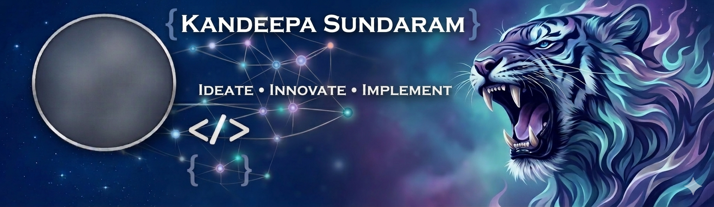

<!-- <h1 align="center">Kandeepa Sundaram</h1> -->

  
  
<h3 align="center">AI Architect · Building Enterprise GenAI & LLM Solutions · 18+ Years in Software Architecture</h3>

  
  
  

***

## 🧠 About Me

- 🤖 **AI Architect** focused on **Generative AI** — RAG pipelines, LLM orchestration, structured-output systems, and AI governance.
- 🏛️ **18+ years** architecting enterprise software at **Cognizant** — microservices, cloud-native platforms, and full-stack systems.
- 🚀 Led the architecture of an **AI-powered SDLC automation platform** (Azure OpenAI GPT-4) that turns Business Requirement Documents into user stories, test cases, and executable test scripts — end to end.
- 🔧 Shipped **[Grit](https://github.com/Kandeepasundaram/Grit)** — an open-source, cross-platform Git identity manager (Python · TypeScript).
- 🛠️ Currently **building a GenAI portfolio in public** — new project + learnings every week.
- 🎓 **Master of Computer Applications (MCA)**, Kumaraguru College of Technology.
- 📍 Based in **Coimbatore, India** · 💼 **Open to AI Architect roles.**

***

## 🛠️ Tech Stack

**🤖 AI / GenAI**

**💻 Languages**

**⚙️ Backend & Frameworks**

**🎨 Frontend**

**☁️ DevOps & Cloud**

***

## 🚀 Featured Projects

### 🔧 Grit — Multi-Identity Git Manager
> A cross-platform background daemon that auto-applies the **right Git identity** (name, email, GPG & SSH keys) per repository
  — no more commits from the wrong account.
- Session-based memory with per-repo profiles; auto-detection via `.grit` files, path, or remote-URL patterns
- Git pre-commit hooks, system-tray indicator, VS Code extension, per-profile GPG signing & SSH routing
- Full test suite (pytest), CI/CD, typed with mypy + ruff
- **Stack:** Python · TypeScript · PyQt6 · Git
- 👉 [View Repo](https://github.com/Kandeepasundaram/Grit)

### 🔎 DocuMind — RAG Document Q&A `🚧 shipping soon`
> Ask questions over any PDF and get answers **with citations** — no "trust me, the AI said so."

- Smart chunking → Gemini embeddings → ChromaDB vector search → cited answers
- Built to be enterprise-integratable: clean REST API + thin React UI
- **Stack:** Python · FastAPI · Gemini · ChromaDB · React
- 👉 [View Repo](https://github.com/Kandeepasundaram/documind)

### 🧩 AgentForge — BRD → Test Artifacts `🚧 shipping soon`
> Turns a feature brief into **user stories → test scenarios → test cases → edge cases** via a validated LLM chain.

- Pydantic-enforced structured output with configurable coverage (smoke / regression / full)
- A personal, open reimplementation of an enterprise SDLC-automation pattern
- **Stack:** Python · Pydantic · Gemini · React
- 👉 [View Repo](https://github.com/Kandeepasundaram/agentforge)

### 🛡️ PromptGuard — Prompt Registry & Evaluation `🚧 shipping soon`
> The unglamorous-but-critical layer: **version, evaluate, and govern** prompts before they hit production.

- Prompt versioning + eval runner scoring relevance, format-compliance, latency, hallucination
- Side-by-side A/B comparison of prompt versions
- **Stack:** Python · FastAPI · SQLite · React
- 👉 [View Repo](https://github.com/Kandeepasundaram/promptguard)

***

## 📊 GitHub Stats

  
  

  

***

## 🤝 Let's Connect

I'm always happy to talk about:
- 🧠 Architecting **production-grade GenAI** (RAG, agents, governance)
- 🏛️ Scaling **enterprise systems** and modernizing legacy platforms
- 💼 **AI Architect** opportunities

📫 Reach me: **[LinkedIn](https://www.linkedin.com/in/kandeepasundaram)** · **kandeepasundaram@gmail.com**

<i>Building GenAI in public — one project at a time. ⭐ the repos to follow along.</i>

